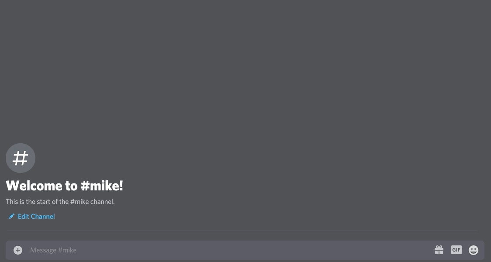

# Bullish Bay Discord Bot

## Grab a stock quote

## or the news!

## Installation Steps
1. Clone repo
2. Run `npm install`
3. Place your env variables inside of `.env_sample` and rename it to `.env`
3. Run `npm run start`
4. Interact with your Discord bot

